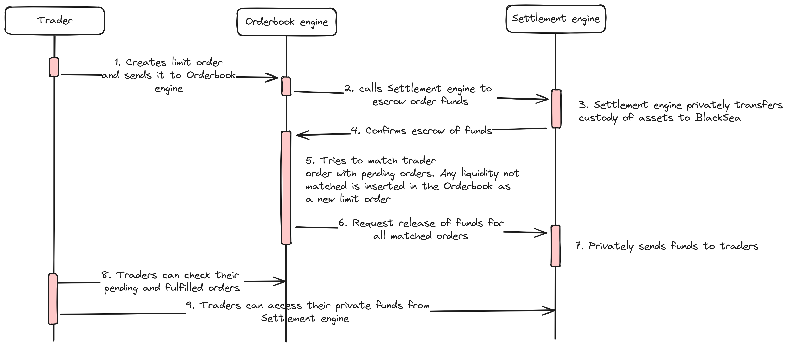

# BlackSea - Cross chain Dark Pool Orderbook
BlackSea is an orderbook matching engine that keeps all pending and executed orders private. Founders, Whales and Institutional Investors can finally trade tokens onchain without being surveilled.

# Problem Statement
Revealing an intention to trade can be a dangerous thing in financial markets, sophisticated market players (in this case, statistical arbitrage MEV bots) can extract value from that information in what is known as signal MEV.

Trading in DeFi through DEXes does not eliminate the problem. DEXes cause slippage, especially when executing large orders against modest liquidity pools. Big trades constantly suffer extreme slippage risks when trading large positions.

The problem only gets worse when the trader is one of the main holders of the token (think of founders, VCs and early investors). In those cases the public disclosure of them selling/buying tokens changes the market perceptions (devs selling tends to negativelly affect price as it shows lack of confidence in the token's future, e.g.).

# Solution
We have built a Private Orderbook smart contract on Oasis Sapphire. By leveraging the privacy preserving properties of Oasis the contract is able to receive, keep and process encrypted limit orders from different traders, never sharing the information with anyone. Whenever 2 limit orders match, the contract executes them without anyone but the parties involved learning about the trade.

The Orderbook is able to process assets from any blockchain by using cross chain message passing to lock and release assets, traders don't need to have tokens in Oasis Sapphire to be able to use it.

# Technical Architecture
The Orderbook is composed of 2 on chain services:
- Orderbook engine
- Settlement engine

Orderbook engine is responsible for receiving, processing, matching and cancelling limit orders. It keeps all pending and past orders private, whenever a new order comes in it tries to execute it against existing liquidity, performing matches.

The current version users RedBlackTrees and LinkedLists to allow log(n) best price searches, order insertion and deletion, being hyper efficient in gas.

Settlement engine is responsible for escrowing assets upon the creation of new orders and releasing assets whenever trades are matched or cancelled.

The current version uses IllumineX's confidential ERC20 tokens to guarantee anonymous escrow and release of tokens. They can be used to wrap assets across multiple chains through the Celar message passing bridge.

# Future Features
BlackSea was built as a hackathon project in ETHDam 2024 to showcase the potential of privacy preserving applications to improve the DeFi ecosystem. It is, however, still a proof of concept.

There are 2 important features to be improved to bring the application to production:

Bridgeless settlement - we intend to build an escrowing technology that leverages Oasis' native keypair and signature generation precompiles to allow BlackSea to process fund settlements in the native chain, without having to bridge them over to Sapphire
Side channel resistancy - we intend to conduct a full audit with TEE experts to patch any possible side channel data leakage, guaranteeing full information privacy for trades